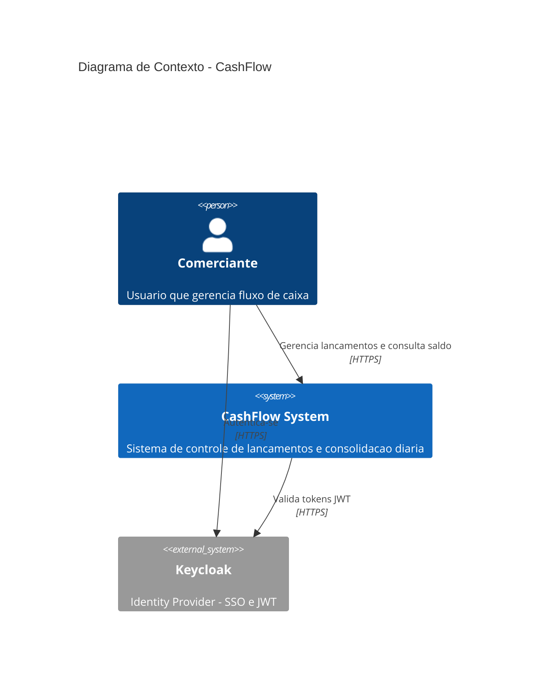

## Description

<!-- SECTION:DESCRIPTION:BEGIN -->
Criar diagrama C4 de Contexto (nivel 1) representando o sistema CashFlow, seus atores e sistemas externos. Formato: Mermaid.

### Atores e Sistemas:
- **Pessoa** (Comerciante) - usuario do sistema
- **CashFlow System** - o sistema sendo modelado (caixa preta)
- **Keycloak** - Identity Provider externo para autenticacao

### Passos para executar:
1. Identificar persona principal (Comerciante) e seus objetivos
2. Identificar sistemas externos (Keycloak)
3. Desenhar as relacoes e fluxos de dados entre eles
4. Validar se todos os bounded contexts estao representados
5. Salvar como docs/c4/context-diagram.md

### Implementacao

<!-- SECTION:DESCRIPTION:END -->

## Acceptance Criteria
<!-- AC:BEGIN -->
- [ ] #1 Diagrama salvo em docs/c4/context-diagram.md
- [ ] #2 Inclui persona Comerciante
- [ ] #3 Inclui sistema externo Keycloak
- [ ] #4 Relacoes e fluxos mapeados
- [ ] #5 Formato Mermaid validado
<!-- AC:END -->
