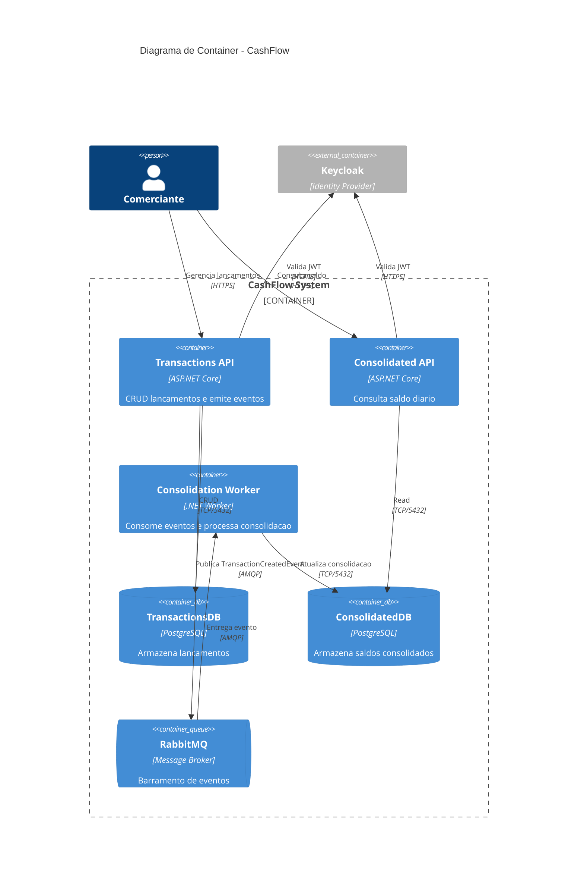

## Description

<!-- SECTION:DESCRIPTION:BEGIN -->
Criar diagrama C4 de Container (nivel 2) decompondo o CashFlow System em 3 microservices + infraestrutura.

### Containers:
- **CashFlow.Service.Transactions** - WebApi (ASP.NET Core) - CRUD + eventos
- **CashFlow.Service.Consolidated** - WebApi (ASP.NET Core) - consulta saldo
- **CashFlow.Worker.Consolidation** - Worker (.NET) - consumer RabbitMQ
- **RabbitMQ** - Message Broker
- **PostgreSQL (TransactionsDB)** - Banco transacional
- **PostgreSQL (ConsolidatedDB)** - Banco de consolidacao
- **Keycloak** - Identity Provider

### Passos para executar:
1. Listar todos os containers com tecnologias e responsabilidades
2. Mapear protocolos de comunicacao entre containers
3. Desenhar relacionamentos entre containers
4. Validar alinhamento com requisitos NF (resiliencia, escala)
5. Salvar como docs/c4/container-diagram.md

### Implementacao

<!-- SECTION:DESCRIPTION:END -->

## Acceptance Criteria
<!-- AC:BEGIN -->
- [ ] #1 Diagrama salvo em docs/c4/container-diagram.md
- [ ] #2 3 microservices representados
- [ ] #3 Infraestrutura (RabbitMQ, PostgreSQL, Keycloak) incluida
- [ ] #4 Protocolos de comunicacao mapeados
- [ ] #5 Formato Mermaid validado
<!-- AC:END -->
