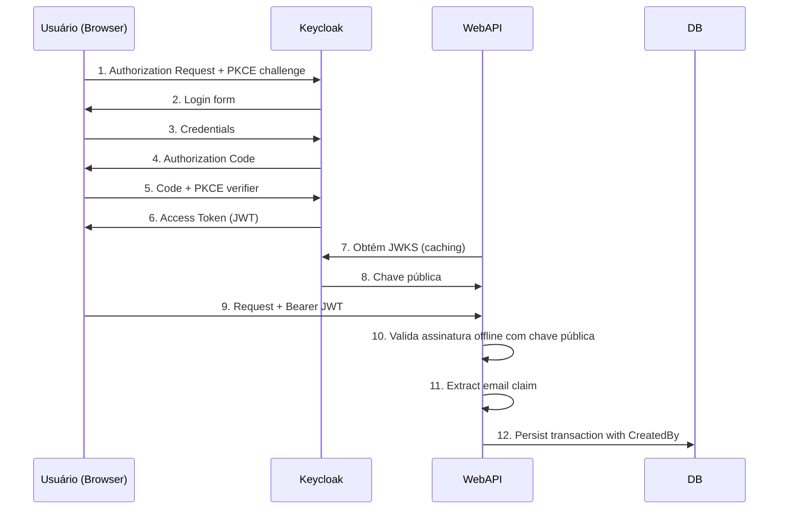

# ADR 003: Autenticação e Autorização com Keycloak

* Status: Accepted
* Date: 2026-07-29

## Context and Problem Statement

Os endpoints das WebAPIs (Transactions e Consolidated) são consumidos por usuários logados (pessoas reais). É necessário autenticar esses usuários e rastrear quem realizou cada lançamento financeiro (audit trail). Como implementar autenticação de forma segura e simples, sem complexidade desnecessária de RBAC?

## Decision Drivers

* Usuários são pessoas reais, não máquinas
* Necessário rastrear autoria dos lançamentos (audit trail)
* Simplicidade: evitar overhead de gerenciamento de roles/permissões
* Segurança: proteger contra ataques de interceptação de token
* Provisionamento via Infrastructure as Code

## Considered Options

* **Keycloak Public Client + PKCE** - Fluxo Authorization Code com PKCE, sem client secret
* **Keycloak Confidential Client** - Client com secret, fluxo Client Credentials
* **Auth0** - Serviço terceiro, sem custo para baixo volume
* **JWT customizado** - Implementação própria de emissão e validação de tokens

## Decision Outcome

Chosen option: **Keycloak com Public Client + Authorization Code + PKCE**

O Keycloak será configurado com um client público (sem secret). Usuários reais autenticam-se via Authorization Code Flow com PKCE. O token JWT conterá as claims `sub`, `email` e `name`. O email do usuário será extraído do token e armazenado em `Transaction.CreatedBy` para audit trail. Não haverá RBAC granular — qualquer usuário autenticado no realm pode operar.

### Fluxo de Autenticação



### Positive Consequences

* Simplicidade: sem gerenciamento de roles, permissions ou policies complexas
* Audit trail: toda transação tem o email do autor rastreado
* Segurança: PKCE protege o fluxo Authorization Code contra ataques MITM
* Provisionamento mínimo: Terraform cria apenas realm + client público

### Negative Consequences

* Sem autorização granular: qualquer usuário autenticado pode realizar qualquer operação
* Delimitação por realm apenas: não é possível restringir acesso a endpoints específicos por usuário

## Terraform

O provisionamento do Keycloak será feito via Terraform, criando:

- **Realm:** `cashflow`
- **Client:** público (access type = public), com:
  - Standard Flow Enabled (Authorization Code)
  - Valid Redirect URIs configurados
  - Mapper de claims: email, name, sub no token de acesso

## Modelagem de Audit

```csharp
public class Transaction
{
    public Guid Id { get; private set; }
    public decimal Amount { get; private set; }
    public TransactionType Type { get; private set; } // Credit | Debit
    public string Description { get; private set; }
    public string CreatedBy { get; private set; } // email do usuário
    public DateTime CreatedAt { get; private set; }
}
```

O campo `CreatedBy` será preenchido com o email extraído da claim `email` do JWT no momento da criação da transação.
