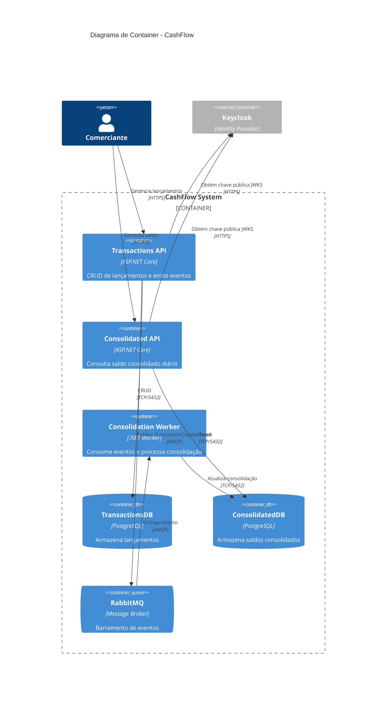

# Diagrama de Container - CashFlow System

## Propósito

Este diagrama C4 de Container (nível 2) mostra a decomposição do CashFlow System em microservices, bancos de dados, message broker e provedor de identidade.

## Diagrama

## Containers

| Container | Tecnologia | Responsabilidade |
|-----------|-----------|------------------|
| **Transactions API** | ASP.NET Core | CRUD de lançamentos (débito/crédito), autenticação JWT, emissão de eventos |
| **Consolidated API** | ASP.NET Core | Consulta de saldo consolidado diário, autenticação JWT (read-only) |
| **Consolidation Worker** | .NET Worker | Consumer RabbitMQ, lógica de agregação e consolidação diária |
| **TransactionsDB** | PostgreSQL | Armazenamento de lançamentos financeiros |
| **ConsolidatedDB** | PostgreSQL | Armazenamento de saldos consolidados por dia |
| **RabbitMQ** | Message Broker | Barramento assíncrono para eventos de transação |

## Comunicação entre Containers

| Origem | Destino | Protocolo | Descrição |
|--------|---------|-----------|-----------|
| Comerciante | Transactions API | HTTPS | CRUD de lançamentos |
| Comerciante | Consolidated API | HTTPS | Consulta de saldo |
| Transactions API | RabbitMQ | AMQP | Publicação de `TransactionCreatedEvent` |
| RabbitMQ | Worker | AMQP | Entrega de evento para processamento |
| Worker | ConsolidatedDB | TCP/5432 | Inserção/atualização de consolidação |
| Transactions API | TransactionsDB | TCP/5432 | Leitura/escrita de lançamentos |
| Consolidated API | ConsolidatedDB | TCP/5432 | Leitura de saldos consolidados |
| Transactions API | Keycloak | HTTPS | Obtenção de chave pública JWKS (offline) |
| Consolidated API | Keycloak | HTTPS | Obtenção de chave pública JWKS (offline) |
