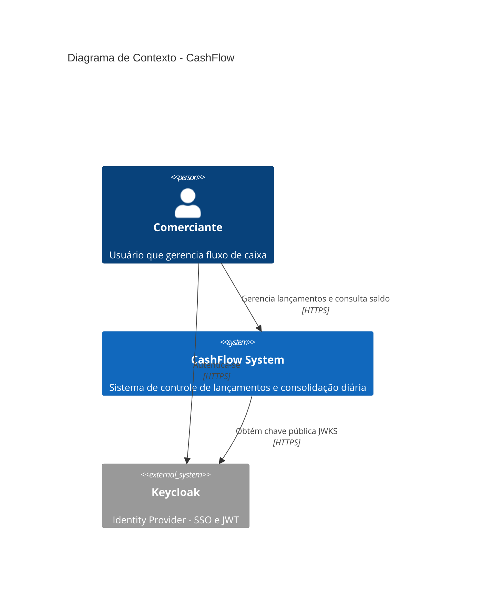

# Diagrama de Contexto - CashFlow System

## Propósito

Este diagrama C4 de Contexto (nível 1) mostra o sistema CashFlow e suas interações com atores externos e sistemas adjacentes.

## Diagrama

## Atores e Sistemas

| Elemento | Tipo | Descrição |
|----------|------|-----------|
| **Comerciante** | Person | Usuário que gerencia o fluxo de caixa diário, realiza lançamentos e consulta saldos |
| **CashFlow System** | System | Sistema principal composto por 3 microservices que controla lançamentos financeiros e consolidação diária |
| **Keycloak** | External System | Identity Provider responsável por autenticação e emissão de tokens JWT |

## Fluxos Principais

1. Comerciante autentica-se no Keycloak (Authorization Code + PKCE)
2. Comerciante gerencia lançamentos via CashFlow System (com token JWT)
3. CashFlow System obtém chave pública JWKS do Keycloak e valida o token offline
4. Comerciante consulta saldo consolidado via CashFlow System
